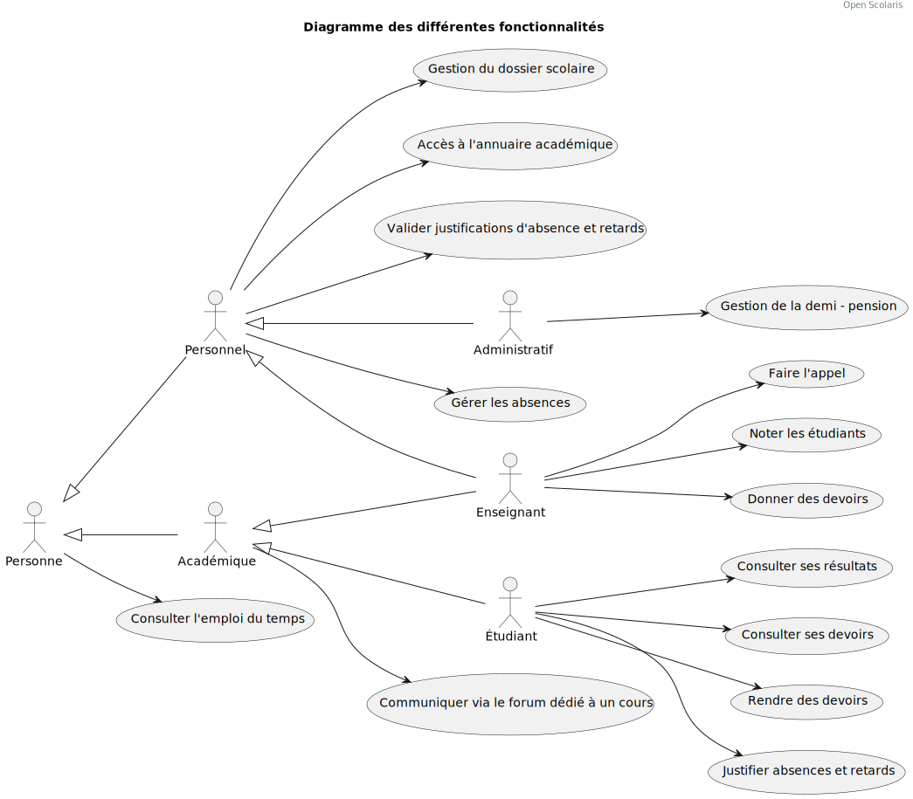

# open-scolaris
An open-source tool for school management, based on django

## Dev

To add : 

- maybe change of main font to *Onest* font (really looking good) but solve problem with specific chars like *à* etc...
- continue on developing towards OpenScolaris Messages
- refactor the logo to get it royalty free (redraw it)